</br>
</br>
</br>
</br>


## Connect to PostgreSQL

```{r,eval=FALSE,message=FALSE}
library(timeseriesdb)
# otherwise use Postgres defaults
con <- db_connection_create(dbname = "mydb",
                            host = "localhost",
                            passwd = ".pgpass",
                            passwd_from_file = TRUE)
```


```{r,echo=FALSE,message=FALSE,warning=FALSE}
library(timeseriesdb)
# otherwise use Postgres defaults
con <- db_connection_create(dbname = "kofdb",
                            host = "archivedb.kof.ethz.ch",
                            passwd = "jlot@@AA13!$")

library(tstools)

uros <- init_tsplot_theme(line_colors = viridis::viridis_pal()(20)[c(1,20,6)],
                          lwd = c(2,2,2))


```


<div class="my-footer"><span><div class="footer-text" align="right">These slides and video presentation by Dr. Matthias Bannert are licensed under <a href="https://creativecommons.org/licenses/by-nc-sa/4.0/?ref=chooser-v1">CC BY-NC-SA 4.0</a></div></span></div>

---


class: center, middle


# 1. Consistent Storage of Time Series


<div class="my-footer"><span><div class="footer-text" align="right">These slides and video presentation by Dr. Matthias Bannert are licensed under <a href="https://creativecommons.org/licenses/by-nc-sa/4.0/?ref=chooser-v1">CC BY-NC-SA 4.0</a></div></span></div>

---


class: center, middle


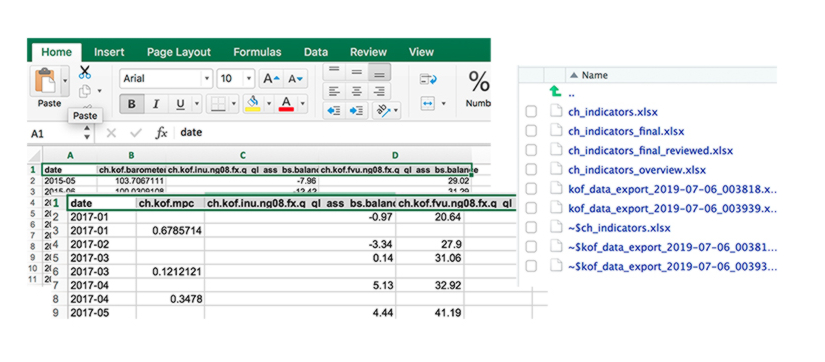


<div class="my-footer"><span><div class="footer-text" align="right">These slides and video presentation by Dr. Matthias Bannert are licensed under <a href="https://creativecommons.org/licenses/by-nc-sa/4.0/?ref=chooser-v1">CC BY-NC-SA 4.0</a></div></span></div>

---


class: center, middle


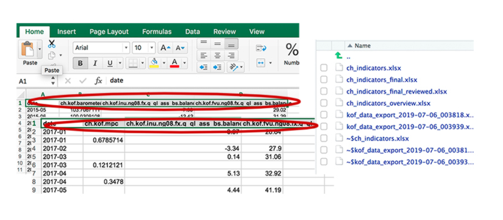


<div class="my-footer"><span><div class="footer-text" align="right">These slides and video presentation by Dr. Matthias Bannert are licensed under <a href="https://creativecommons.org/licenses/by-nc-sa/4.0/?ref=chooser-v1">CC BY-NC-SA 4.0</a></div></span></div>

---


class: center, middle


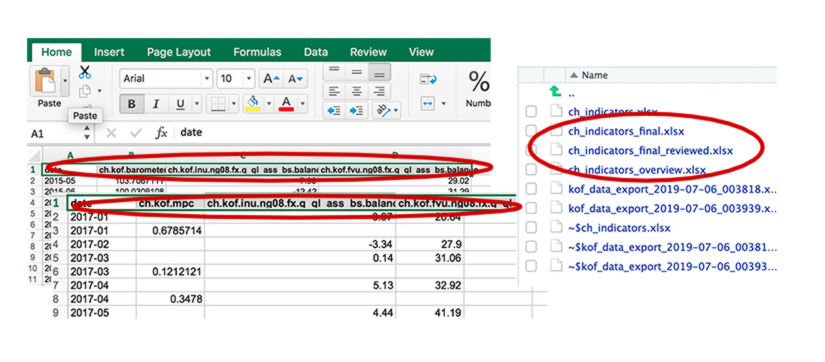


<div class="my-footer"><span><div class="footer-text" align="right">These slides and video presentation by Dr. Matthias Bannert are licensed under <a href="https://creativecommons.org/licenses/by-nc-sa/4.0/?ref=chooser-v1">CC BY-NC-SA 4.0</a></div></span></div>

---


class: center, middle


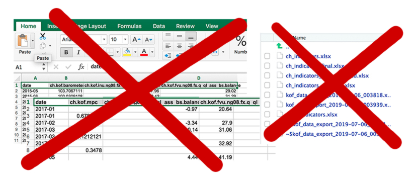


<div class="my-footer"><span><div class="footer-text" align="right">These slides and video presentation by Dr. Matthias Bannert are licensed under <a href="https://creativecommons.org/licenses/by-nc-sa/4.0/?ref=chooser-v1">CC BY-NC-SA 4.0</a></div></span></div>

---


## Store Time Series to the Database


.pull-left[

```{r, eval=FALSE, echo=TRUE}
library(timeseriesdb)

lots <- list(ts1 = ts(rnorm(100),
                      start = c(1990,1),
                      freq = 4),
             ts2 = ts(rnorm(135),
                      start = c(1994,3),
                      freq = 12)

db_ts_store(con, lots)
```


]


.pull-right[

### Basic Store Process

- list of time series
- unique identifiers = element names


### Advantages Over File Based Storage

- no redundant keys across files
- constraints are easy to implement 


]

<div class="my-footer"><span><div class="footer-text" align="right">These slides and video presentation by Dr. Matthias Bannert are licensed under <a href="https://creativecommons.org/licenses/by-nc-sa/4.0/?ref=chooser-v1">CC BY-NC-SA 4.0</a></div></span></div>

---


class: center, middle


# 2. Vintages (Versioning for Time Series)


<div class="my-footer"><span><div class="footer-text" align="right">These slides and video presentation by Dr. Matthias Bannert are licensed under <a href="https://creativecommons.org/licenses/by-nc-sa/4.0/?ref=chooser-v1">CC BY-NC-SA 4.0</a></div></span></div>

---

## KOF Tourism Forecast


```{r,fig.width=14, fig.height=4}
prev <- db_ts_read(con,
                   ts_keys = "ch.kof.trsm.fcst.ws.l.all.ch.lg",
                   valid_on = "2020-10-20") #<<
tstools::tsplot(
  list(
  "previous tourism forecast" = 
    prev$ch.kof.trsm.fcst.ws.l.all.ch.lg
    ), manual_value_ticks_l = c(10000,12000,14000,16000,18000),
  theme = uros)


```

<div class="my-footer"><span><div class="footer-text" align="right">These slides and video presentation by Dr. Matthias Bannert are licensed under <a href="https://creativecommons.org/licenses/by-nc-sa/4.0/?ref=chooser-v1">CC BY-NC-SA 4.0</a></div></span></div>

---

## KOF Tourism Forecast


```{r,fig.width=14, fig.height=4}
curr <- db_ts_read(con, #<<
                   ts_keys = "ch.kof.trsm.fcst.ws.l.all.ch.lg") #<<
tstools::tsplot(
  list(
  "previous tourism forecast" = 
    prev$ch.kof.trsm.fcst.ws.l.all.ch.lg,
  "current tourism forecast" = 
    curr$ch.kof.trsm.fcst.ws.l.all.ch.lg
), manual_value_ticks_l = c(10000,12000,14000,16000,18000),
theme = uros)

```

<div class="my-footer"><span><div class="footer-text" align="right">These slides and video presentation by Dr. Matthias Bannert are licensed under <a href="https://creativecommons.org/licenses/by-nc-sa/4.0/?ref=chooser-v1">CC BY-NC-SA 4.0</a></div></span></div>

---


class: center, middle


# 3. Multi-Language Meta Information


<div class="my-footer"><span><div class="footer-text" align="right">These slides and video presentation by Dr. Matthias Bannert are licensed under <a href="https://creativecommons.org/licenses/by-nc-sa/4.0/?ref=chooser-v1">CC BY-NC-SA 4.0</a></div></span></div>

---

## Comprehensive Multi-Lingual Meta Information


```{r}
db_metadata_read(
  con,
  "ch.kof.inu.ng08.fx.sector_4d.2652.q_ql_ass_bs.balance",
  locale = "de",
  valid_on = Sys.Date())
```

<div class="my-footer"><span><div class="footer-text" align="right">These slides and video presentation by Dr. Matthias Bannert are licensed under <a href="https://creativecommons.org/licenses/by-nc-sa/4.0/?ref=chooser-v1">CC BY-NC-SA 4.0</a></div></span></div>

---


## Comprehensive Multi-Lingual Meta Information


```{r}
db_metadata_read(
  con,
  "ch.kof.inu.ng08.fx.sector_4d.2652.q_ql_ass_bs.balance",
  locale = "fr",
  valid_on = Sys.Date())
```

<div class="my-footer"><span><div class="footer-text" align="right">These slides and video presentation by Dr. Matthias Bannert are licensed under <a href="https://creativecommons.org/licenses/by-nc-sa/4.0/?ref=chooser-v1">CC BY-NC-SA 4.0</a></div></span></div>

---


## Comprehensive Multi-Lingual Meta Information

```{r}
db_metadata_read(
  con,
  "ch.kof.inu.ng08.fx.sector_4d.2652.q_ql_ass_bs.balance",
  locale = "en",
  valid_on = Sys.Date())
```

<div class="my-footer"><span><div class="footer-text" align="right">These slides and video presentation by Dr. Matthias Bannert are licensed under <a href="https://creativecommons.org/licenses/by-nc-sa/4.0/?ref=chooser-v1">CC BY-NC-SA 4.0</a></div></span></div>

---


class: center, middle


# How Does {timeseriesdb} Work ?


<div class="my-footer"><span><div class="footer-text" align="right">These slides and video presentation by Dr. Matthias Bannert are licensed under <a href="https://creativecommons.org/licenses/by-nc-sa/4.0/?ref=chooser-v1">CC BY-NC-SA 4.0</a></div></span></div>

---

class:center,middle

## R and PostgreSQL

<div class="my-footer"><span><div class="footer-text" align="right">These slides and video presentation by Dr. Matthias Bannert are licensed under <a href="https://creativecommons.org/licenses/by-nc-sa/4.0/?ref=chooser-v1">CC BY-NC-SA 4.0</a></div></span></div>

---


class: center,middle

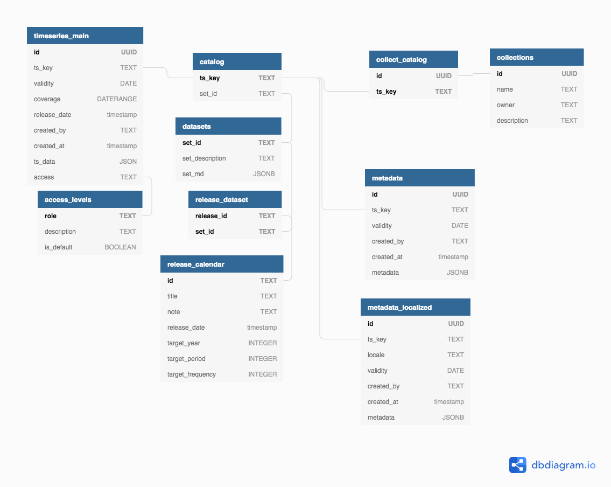


<div class="my-footer"><span><div class="footer-text" align="right">These slides and video presentation by Dr. Matthias Bannert are licensed under <a href="https://creativecommons.org/licenses/by-nc-sa/4.0/?ref=chooser-v1">CC BY-NC-SA 4.0</a></div></span></div>

---


class: center,middle

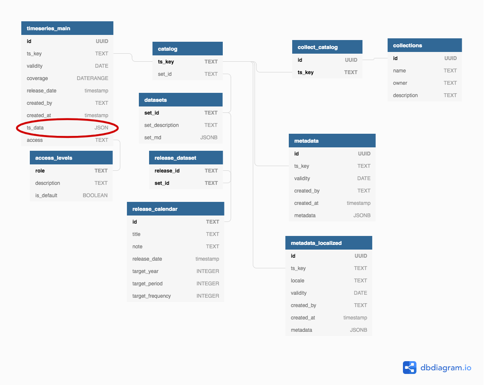


<div class="my-footer"><span><div class="footer-text" align="right">These slides and video presentation by Dr. Matthias Bannert are licensed under <a href="https://creativecommons.org/licenses/by-nc-sa/4.0/?ref=chooser-v1">CC BY-NC-SA 4.0</a></div></span></div>

---


class: center,middle

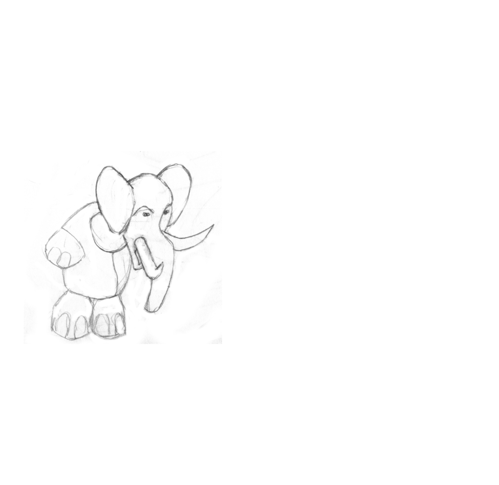


<div class="my-footer"><span><div class="footer-text" align="right">These slides and video presentation by Dr. Matthias Bannert are licensed under <a href="https://creativecommons.org/licenses/by-nc-sa/4.0/?ref=chooser-v1">CC BY-NC-SA 4.0</a></div></span></div>

---


class: center,middle

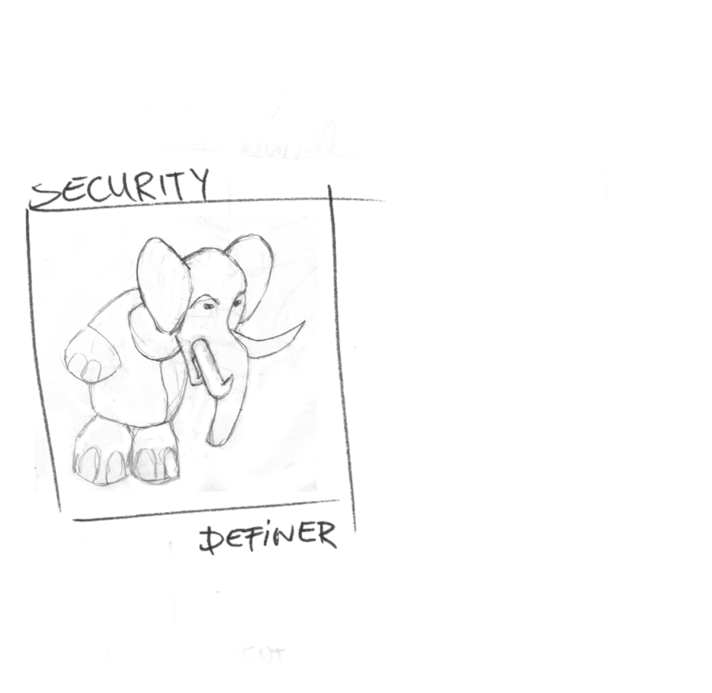


<div class="my-footer"><span><div class="footer-text" align="right">These slides and video presentation by Dr. Matthias Bannert are licensed under <a href="https://creativecommons.org/licenses/by-nc-sa/4.0/?ref=chooser-v1">CC BY-NC-SA 4.0</a></div></span></div>

---


class: center,middle

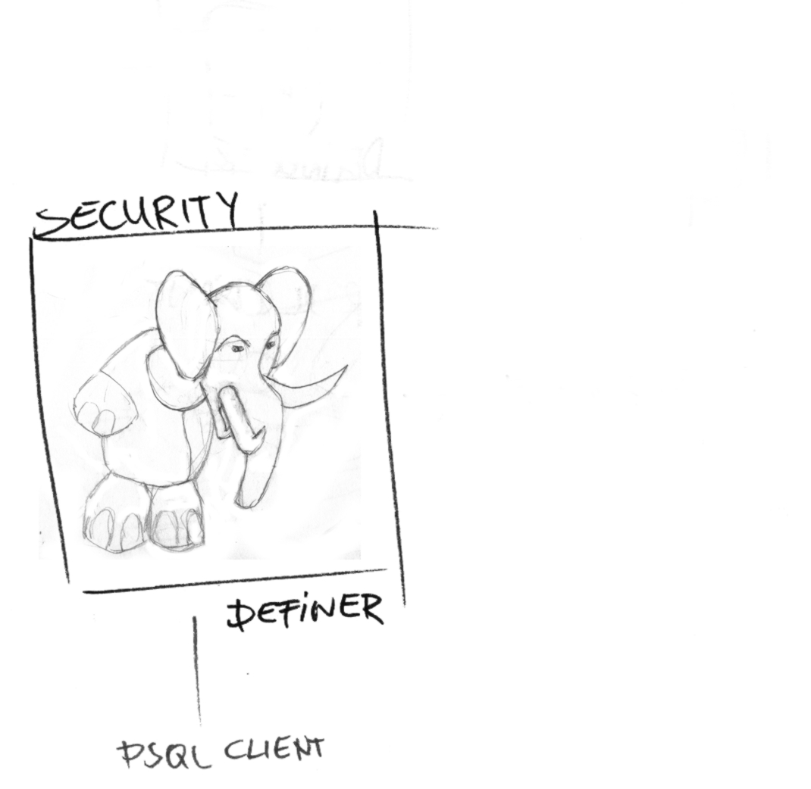


<div class="my-footer"><span><div class="footer-text" align="right">These slides and video presentation by Dr. Matthias Bannert are licensed under <a href="https://creativecommons.org/licenses/by-nc-sa/4.0/?ref=chooser-v1">CC BY-NC-SA 4.0</a></div></span></div>

---


class: center,middle

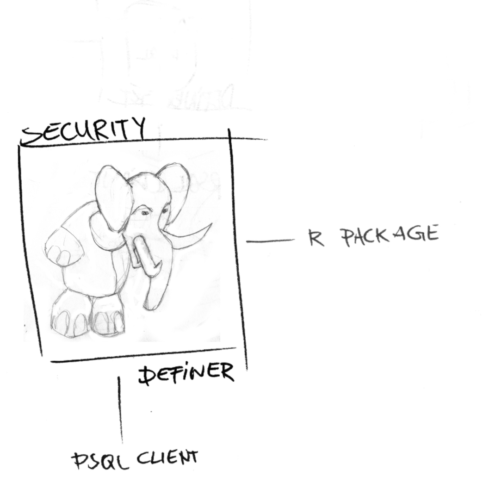


<div class="my-footer"><span><div class="footer-text" align="right">These slides and video presentation by Dr. Matthias Bannert are licensed under <a href="https://creativecommons.org/licenses/by-nc-sa/4.0/?ref=chooser-v1">CC BY-NC-SA 4.0</a></div></span></div>

---


class: center,middle

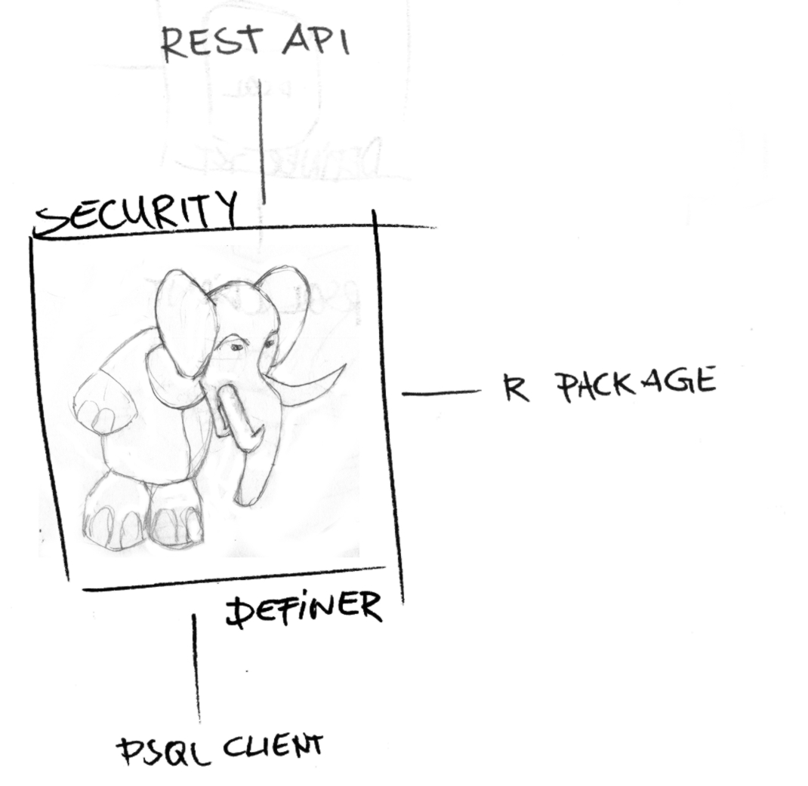


<div class="my-footer"><span><div class="footer-text" align="right">These slides and video presentation by Dr. Matthias Bannert are licensed under <a href="https://creativecommons.org/licenses/by-nc-sa/4.0/?ref=chooser-v1">CC BY-NC-SA 4.0</a></div></span></div>

---


## {timeseriesdb} Functions: Time Series Level


```{r,eval=FALSE}

db_ts_read(con, vector_of_keys) #<<
db_ts_store(con, list_of_time_series) #<<
db_ts_find_keys(con, regular_expression)
db_ts_get_last_update(con, vector_of_keys)
db_ts_read_history(con, time_series_key)
...

```

```{r}
db_ts_read(con,"ch.kof.dlu.ng08.fx.q_ql_ass_bs.balance")
```


<div class="my-footer"><span><div class="footer-text" align="right">These slides and video presentation by Dr. Matthias Bannert are licensed under <a href="https://creativecommons.org/licenses/by-nc-sa/4.0/?ref=chooser-v1">CC BY-NC-SA 4.0</a></div></span></div>

---

## {timeseriesdb} Functions: Time Series Level


```{r,eval=FALSE}

db_ts_read(con, vector_of_keys) 
db_ts_store(con, list_of_time_series) 
db_ts_find_keys(con, regular_expression) #<<
db_ts_get_last_update(con, vector_of_keys)
db_ts_read_history(con, time_series_key)
...

```

```{r}
db_ts_find_keys(con, "ch.kof.ie")
```


<div class="my-footer"><span><div class="footer-text" align="right">These slides and video presentation by Dr. Matthias Bannert are licensed under <a href="https://creativecommons.org/licenses/by-nc-sa/4.0/?ref=chooser-v1">CC BY-NC-SA 4.0</a></div></span></div>

---


## {timeseriesdb} Functions: Time Series Level


```{r,eval=FALSE}

db_ts_read(con, vector_of_keys) 
db_ts_store(con, list_of_time_series) 
db_ts_find_keys(con, regular_expression)
db_ts_get_last_update(con, vector_of_keys)
db_ts_read_history(con, time_series_key) #<<
...

```

```{r}
tsl <- db_ts_read_history(con, "ch.kof.barometer")
names(tsl)

```


<div class="my-footer"><span><div class="footer-text" align="right">These slides and video presentation by Dr. Matthias Bannert are licensed under <a href="https://creativecommons.org/licenses/by-nc-sa/4.0/?ref=chooser-v1">CC BY-NC-SA 4.0</a></div></span></div>

---


## {timeseriesdb} Functions: Dataset Level

```{r, eval=FALSE}

db_dataset_create(con,
                  set_name = ,
                  set_description = ,
                  set_md = )

db_dataset_get_keys(con, set_name = )

db_dataset_get_next_release(con, vector_of_set_ids)

```

<div class="my-footer"><span><div class="footer-text" align="right">These slides and video presentation by Dr. Matthias Bannert are licensed under <a href="https://creativecommons.org/licenses/by-nc-sa/4.0/?ref=chooser-v1">CC BY-NC-SA 4.0</a></div></span></div>

---


## {timeseriesdb} Functions: Dataset Level

```{r, eval=FALSE}

db_dataset_create(con,
                  set_name = ,
                  set_description = ,
                  set_md = )

db_dataset_get_keys(con, set_name = )

db_dataset_get_next_release(con, vector_of_set_ids)

```

## {timeseriesdb} Functions: Collections

```{r, eval=FALSE}

db_collection_add_ts(con,
                     collection_name = ,
                     ts_keys = ,
                     description = ,
                     user = )


```

<div class="my-footer"><span><div class="footer-text" align="right">These slides and video presentation by Dr. Matthias Bannert are licensed under <a href="https://creativecommons.org/licenses/by-nc-sa/4.0/?ref=chooser-v1">CC BY-NC-SA 4.0</a></div></span></div>

---


## {timeseriesdb} Functions: Access Management


.pull-left[

```{r, eval=FALSE}

db_access_level_create(con, "access_level_name")
db_access_level_delete(con, "access_level_name")
db_access_level_list(con)
db_access_level_set_default(con, access_level)

db_ts_store(con,
            list_of_time_series,
            access = "access_level_name") #<<

db_ts_change_access(con,
                    ts_keys = ,
                    new_access_level = ) #<<


```

]

.pull-right[

- Time Series Version Level Access Management
- PostgreSQL: Row Level Security

]

<div class="my-footer"><span><div class="footer-text" align="right">These slides and video presentation by Dr. Matthias Bannert are licensed under <a href="https://creativecommons.org/licenses/by-nc-sa/4.0/?ref=chooser-v1">CC BY-NC-SA 4.0</a></div></span></div>

---


## {timeseriesdb} Functions: Meta Description


.pull-left[

```{r, eval=FALSE}

db_metadata_read(con = ,
                 valid_on = ,
                 ts_keys = ,
                 regex = ,
                 locale = )
db_metadata_store(con, metadata = )
db_meta_get_latest_validity(con, ts_keys = )
```


]

.pull-right[

- Time Series Level
- Vintage Level
- Dataset Level
- Multi-Lingual

]


<div class="my-footer"><span><div class="footer-text" align="right">These slides and video presentation by Dr. Matthias Bannert are licensed under <a href="https://creativecommons.org/licenses/by-nc-sa/4.0/?ref=chooser-v1">CC BY-NC-SA 4.0</a></div></span></div>

---


class: center, middle

# [mbannert.github.io/timeseriesdb](https://mbannert.github.io/timeseriesdb)


<div class="my-footer"><span><div class="footer-text" align="right">These slides and video presentation by Dr. Matthias Bannert are licensed under <a href="https://creativecommons.org/licenses/by-nc-sa/4.0/?ref=chooser-v1">CC BY-NC-SA 4.0</a></div></span></div>

---


class: center, middle


# How To Get Started?


<div class="my-footer"><span><div class="footer-text" align="right">These slides and video presentation by Dr. Matthias Bannert are licensed under <a href="https://creativecommons.org/licenses/by-nc-sa/4.0/?ref=chooser-v1">CC BY-NC-SA 4.0</a></div></span></div>

---

## If PostgreSQL is installed... 


.pull-left[

## PostgreSQL

- dedicated schema
- install PG extensions *uuid-ossp* and *btree_gist*
- create schema admins

(see [installation guide](https://mbannert.github.io/timeseriesdb/articles/installation_guide.html))

]


<div class="my-footer"><span><div class="footer-text" align="right">These slides and video presentation by Dr. Matthias Bannert are licensed under <a href="https://creativecommons.org/licenses/by-nc-sa/4.0/?ref=chooser-v1">CC BY-NC-SA 4.0</a></div></span></div>

---

## If PostgreSQL is installed... 


.pull-left[

## PostgreSQL

- dedicated schema
- install PG extensions *uuid-ossp* and *btree_gist*
- create schema admins

(see [installation guide](https://mbannert.github.io/timeseriesdb/articles/installation_guide.html))

]

.pull-right[

## R


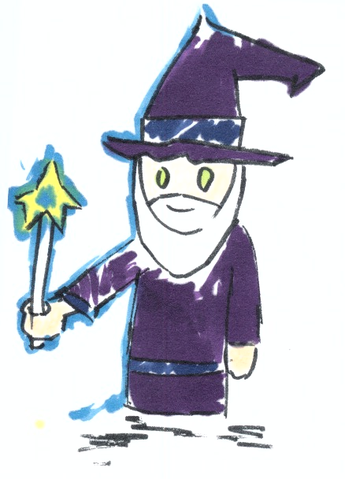


]


<div class="my-footer"><span><div class="footer-text" align="right">These slides and video presentation by Dr. Matthias Bannert are licensed under <a href="https://creativecommons.org/licenses/by-nc-sa/4.0/?ref=chooser-v1">CC BY-NC-SA 4.0</a></div></span></div>

---


## If PostgreSQL is installed... 


.pull-left[

## PostgreSQL

- dedicated schema
- install PG extensions *uuid-ossp* and *btree_gist*
- create schema admins

(see [installation guide](https://mbannert.github.io/timeseriesdb/articles/installation_guide.html))

]

.pull-right[

## R

```{r, eval=FALSE}

install_timeseriesdb(con,
                     install_tables = TRUE,
                     install_functions = TRUE,
                     schema = "tsdb_playground")


```


]


<div class="my-footer"><span><div class="footer-text" align="right">These slides and video presentation by Dr. Matthias Bannert are licensed under <a href="https://creativecommons.org/licenses/by-nc-sa/4.0/?ref=chooser-v1">CC BY-NC-SA 4.0</a></div></span></div>

---


class:center,middle

## [./start_dev_docker.sh](https://github.com/mbannert/timeseriesdb/blob/v1/inst/start_dev_docker.sh)


<div class="my-footer"><span><div class="footer-text" align="right">These slides and video presentation by Dr. Matthias Bannert are licensed under <a href="https://creativecommons.org/licenses/by-nc-sa/4.0/?ref=chooser-v1">CC BY-NC-SA 4.0</a></div></span></div>

---

## Summary: Why Test {timeseriesdb} ? 

- Easy to try out

<div class="my-footer"><span><div class="footer-text" align="right">These slides and video presentation by Dr. Matthias Bannert are licensed under <a href="https://creativecommons.org/licenses/by-nc-sa/4.0/?ref=chooser-v1">CC BY-NC-SA 4.0</a></div></span></div>

---

## Summary: Why Test {timeseriesdb} ? 

- Easy to try out
- You can grow into it


<div class="my-footer"><span><div class="footer-text" align="right">These slides and video presentation by Dr. Matthias Bannert are licensed under <a href="https://creativecommons.org/licenses/by-nc-sa/4.0/?ref=chooser-v1">CC BY-NC-SA 4.0</a></div></span></div>

---

## Summary: Why Test {timeseriesdb} ? 

- Easy to try out
- You can grow into it
- Production tested in economic statistics since 2012

<div class="my-footer"><span><div class="footer-text" align="right">These slides and video presentation by Dr. Matthias Bannert are licensed under <a href="https://creativecommons.org/licenses/by-nc-sa/4.0/?ref=chooser-v1">CC BY-NC-SA 4.0</a></div></span></div>

---

## Summary: Why Test {timeseriesdb} ? 

- Easy to try out
- You can grow into it
- Production tested in economic statistics since 2012
- light weight, license cost free

<div class="my-footer"><span><div class="footer-text" align="right">These slides and video presentation by Dr. Matthias Bannert are licensed under <a href="https://creativecommons.org/licenses/by-nc-sa/4.0/?ref=chooser-v1">CC BY-NC-SA 4.0</a></div></span></div>

---

## Summary: Why Test {timeseriesdb} ? 

- Easy to try out
- You can grow into it
- Production tested in economic statistics since 2012
- light weight, license cost free
- documentation


<div class="my-footer"><span><div class="footer-text" align="right">These slides and video presentation by Dr. Matthias Bannert are licensed under <a href="https://creativecommons.org/licenses/by-nc-sa/4.0/?ref=chooser-v1">CC BY-NC-SA 4.0</a></div></span></div>

---

## Summary: Why Test {timeseriesdb} ? 

- Easy to try out
- You can grow into it
- Production tested in economic statistics since 2012
- light weight, license cost free
- documentation
- API ready, language agnostic logic

<div class="my-footer"><span><div class="footer-text" align="right">These slides and video presentation by Dr. Matthias Bannert are licensed under <a href="https://creativecommons.org/licenses/by-nc-sa/4.0/?ref=chooser-v1">CC BY-NC-SA 4.0</a></div></span></div>

---

class:center,middle

## An Application Beyond R

[https://kof.ethz.ch/prognosen-indikatoren/indikatoren/kof-konjunkturbarometer.html](https://kof.ethz.ch/prognosen-indikatoren/indikatoren/kof-konjunkturbarometer.html)

(uses KOF Datenservice REST API)


<div class="my-footer"><span><div class="footer-text" align="right">These slides and video presentation by Dr. Matthias Bannert are licensed under <a href="https://creativecommons.org/licenses/by-nc-sa/4.0/?ref=chooser-v1">CC BY-NC-SA 4.0</a></div></span></div>

---

## Resources

- Documentation (pkgdown): https://mbannert.github.io/timeseriesdb/
- Development: https://github.com/mbannert/timeseriesdb/tree/v1
- CRAN: https://cran.r-project.org/package=timeseriesdb


>Note: timeseriesdb 1.0 is not on CRAN yet, the CRAN version is outdated. Use the v1 branch on github.com/timeseriesdb if you want to test the water. 

<div class="my-footer"><span><div class="footer-text" align="right">These slides and video presentation by Dr. Matthias Bannert are licensed under <a href="https://creativecommons.org/licenses/by-nc-sa/4.0/?ref=chooser-v1">CC BY-NC-SA 4.0</a></div></span></div>


```{r,echo=FALSE,warning=FALSE,message=FALSE}
db_connection_close(con)

```


## Feedback Welcome! 

- Issue Tracker: https://github.com/mbannert/timeseriesdb/issues
- Twitter: https://twitter.com/whatsgoodio


